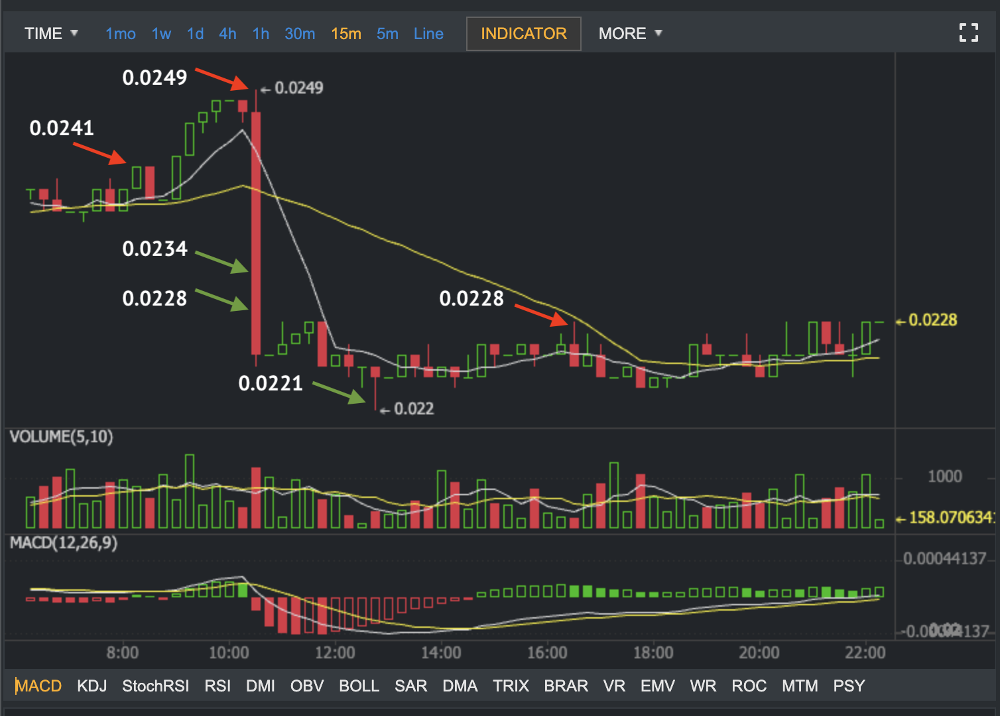
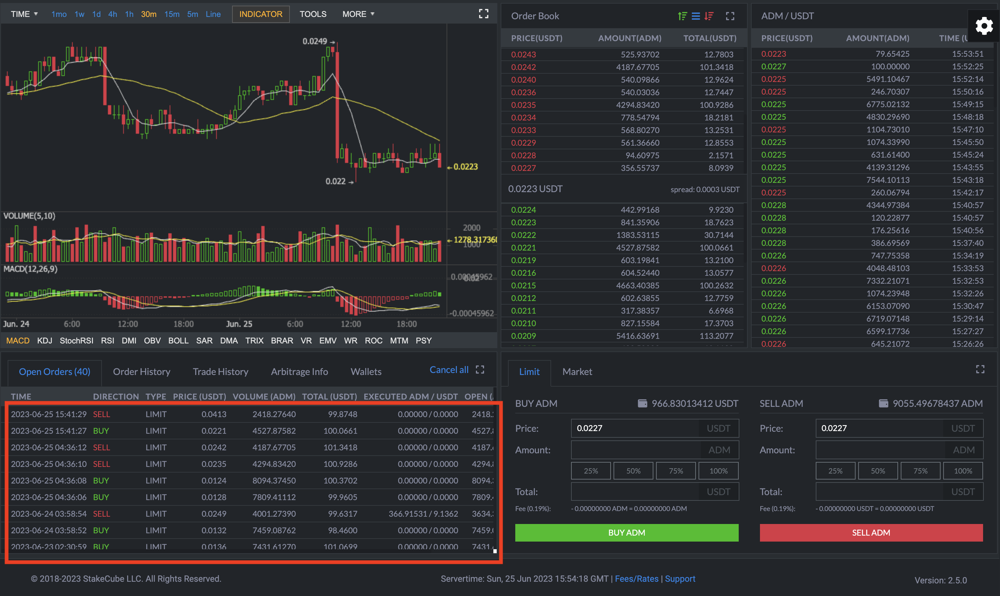

ADAMANT CoinOptimus is a free self-hosted cryptocurrency trade bot.

The bot trades with a 3% price step with Ladder/Grid trading strategy:



# For whom

CoinOptimus targets:

* Non-professional traders who don't require comprehensive setup and analysis tools
* Traders who don't want to trust third-party tools — CoinOptimus is self-hosted
* Crypto enthusiasts who trade from time to time and want to automate some parts
* Crypto project owners, market makers, and exchanges: with the ladder trade strategy, the bot fills order books/ depth/ liquidity

# Features

* Self-hosted bot
* You don't provide trading keys to third parties
* Easy to install and configure
* Modular structure for exchange support and trading strategies
* Optimal ladder/grid trade strategy
* Managed with your commands using ADAMANT Messenger
* Commands include placing orders, getting user and market info
* Notifications to ADAMANT Messenger, Slack, and Discord

# How CoinOptimus works

CoinOptimus is software written on Node.js and constantly running on your server/VPS. First, you set up a config: what exchange to trade and what pair. It uses API keys, which you get from a crypto exchange, and crypto balances on your exchange account. To manage a bot, it accepts commands. You command to run a trading strategy, and a bot places orders and run trades.

# Trade strategies

Currently, the only trade strategy implemented is the Optimal ladder/grid trade strategy, when a bot places many orders to buy and sell tokens with prices starting from the spread. When the closest to spread order is filled, a bot adds the same order to the opposite side, following the rule "buy lower than you sell, and sell higher than you buy". It works best in a volatile market.

See trades history example with a 3% price step:



# Supported exchanges

* [Binance](https://binance.com)
* [P2PB2B](https://p2pb2b.com)
* [Azbit](https://azbit.com?referralCode=9YVWYAF)
* [StakeCube](https://stakecube.net/?team=adm)
* [Bitfinex](https://bitfinex.com)

# Usage and Installation

## Requirements

* Ubuntu 18–22, centOS 8 (we didn't test others)
* NodeJS v16+
* MongoDB v6+ ([installation instructions](https://docs.mongodb.com/manual/tutorial/install-mongodb-on-ubuntu/))

## Setup

```
git clone https://github.com/Adamant-im/adamant-coinoptimus
cd ./adamant-coinoptimus
npm i
```

## Pre-launch tuning

The bot will use `config.jsonc`, if available, or `config.default.jsonc` otherwise.

```
cp config.default.jsonc config.jsonc
nano config.jsonc
```

Parameters: see comments in the config file.

## Launching

You can start the Bot with the `node app` command, but it is recommended to use the process manager for this purpose.

```
pm2 start app.js --name coinoptimus
```

## Updating

```
pm2 stop coinoptimus
cd ./adamant-coinoptimus
git pull
npm i
```

Update `config.jsonc` if `config.default.jsonc` changed.

Then `pm2 restart tradebot`.

## Commands and starting a strategy

After installation, you control the bot in secure ADAMANT Messenger chat directly.

Available commands: see [CoinOptimus wiki](https://github.com/Adamant-im/adamant-coinoptimus/wiki).

# Get help

To get help with CoinOptimus, join ADAMANT's communities — see [adamant.im's footer](https://adamant.im).

# Contribution

See [CONTRIBUTING.md](CONTRIBUTING.md).

# Donate

To Donate, send coins to [ADAMANT Foundation donation wallets](https://adamant.im/donate) or in chat to [Donate to ADAMANT Foundation](https://msg.adamant.im/?address=U380651761819723095&label=Donate+to+ADAMANT+Foundation).

# Disclaimer

CoinOptimus is NOT a sure-fire profit machine. Use it AT YOUR OWN RISK.
